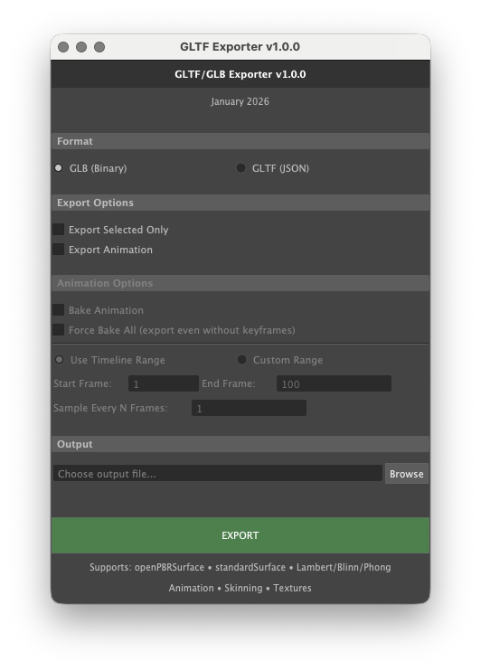

# Maya GLTF/GLB Exporter

GLTF 2.0 exporter for Autodesk Maya 2026+ with full animation and material support.

[](https://github.com/yourusername/maya-gltf-exporter)
[](https://www.autodesk.com/products/maya/)
[](LICENSE)



## Features

### 🎨 Materials
- **openPBRSurface** - Full PBR workflow support
- **standardSurface** - Maya's standard shader
- **Legacy Materials** - Lambert, Blinn, Phong
- **Extensions** - KHR_materials_clearcoat, KHR_materials_sheen
- **Textures** - Base color, metallic, roughness, normal, emission, opacity

### 🎬 Animation
- **Transform Animation** - Rotation, translation, scale
- **World-Space Baking** - Works with any hierarchy
- **Frame Sampling** - Custom frame ranges and sample rates
- **Skeletal Animation** - Full skinCluster support

### 🏗️ Hierarchy Support
- ✅ Nested groups (any depth)
- ✅ Parent transforms with rotation/scale
- ✅ Frozen or unfrozen transforms
- ✅ Offset pivots
- ✅ Mixed animated and static objects

### 📦 Export Formats
- **GLB** - Single binary file with embedded textures
- **GLTF** - JSON + separate bin and texture files

## Quick Start

### Installation

1. Download `maya_gltf_exporter_v3.0.1.py`
2. Open Maya's **Script Editor** (Windows > General Editors > Script Editor)
3. Switch to **Python** tab
4. **Paste** the entire script
5. **Execute** (Ctrl+Enter / Cmd+Return)

### Basic Usage

```python
# The exporter UI will appear automatically
# 1. Choose GLB or GLTF format
# 2. Browse to output location
# 3. Check "Export Animation" if needed
# 4. Click EXPORT
```

### Animation Export

```python
# In the exporter UI:
☑ Export Animation
● Use Timeline Range  # or set custom range
Sample Every: 1       # frames (1 = smooth, 2+ = smaller file)
```

## Why v3.0.1?

**v3.0.1 is the stable release** with pure world-space baking for reliable exports.

See [CHANGELOG.md](CHANGELOG.md) for full version history and technical details.

**Key improvements:**
- Works with any hierarchy depth
- Correct animation rotation regardless of parent transforms
- Meshes positioned exactly as they appear in Maya
- No special scene preparation needed

## Material Support

### openPBRSurface
```
baseColor, baseMetalness, specularRoughness
→ GLTF pbrMetallicRoughness

geometryNormal → normalTexture
emissionColor × emissionLuminance → emissive
coatWeight, coatRoughness → KHR_materials_clearcoat
fuzzWeight, fuzzColor → KHR_materials_sheen
```

### standardSurface
```
baseColor, metalness, specularRoughness
→ GLTF pbrMetallicRoughness

normalCamera → normalTexture
emission → emissive
coat → KHR_materials_clearcoat
sheen → KHR_materials_sheen
```

## Compatibility

### Tested With
- **Maya 2026** (primary target)
- **Three.js** - Full support
- **Babylon.js** - Full support  
- **glTF Viewer** - donmccurdy.com
- **Blender** - Import tested

### GLTF Spec
- **Version:** GLTF 2.0
- **Extensions:** KHR_materials_clearcoat, KHR_materials_sheen
- **Validation:** Passes Khronos glTF-Validator

## Common Workflows

### Static Model
```
1. Model in Maya
2. Run exporter
3. Choose GLB format
4. Export
✓ Done
```

### Animated Model
```
1. Model and animate in Maya (any hierarchy)
2. Run exporter  
3. ☑ Export Animation
4. Choose timeline or custom range
5. Export
✓ Animation works correctly
```

### Hierarchy Changes
```
Want to reorganize your scene?
1. Group/ungroup objects as needed
2. Transform parent groups
3. Export
✓ Still works - no special steps needed
```

## Troubleshooting

### Animation on wrong axis
**Fixed in v3.0.1** - Update to latest version

### Meshes in wrong position
**Fixed in v3.0.1** - Now uses world-space bounding box center

### Textures not showing
- Ensure texture paths are valid
- Use PNG or JPEG for GLB format
- Check file paths contain no special characters

### Animation not exporting
- Verify "Export Animation" is checked
- Ensure objects have keyframes
- Check timeline range is correct

## Technical Details

### World-Space Baking (v3.0.1)
```python
# For each frame:
mesh_center = get_bounding_box_center(worldSpace=True)
world_rotation = extract_rotation_from_world_matrix()

# For animated meshes:
# - Un-rotate vertices to identity
# - Animation rotates from clean orientation
# - Rotation axis matches Maya exactly
```

### Coordinate System
Maya's Y-up, right-handed system = GLTF 2.0 spec (no conversion needed)

## Limitations

**Not Currently Supported:**
- Blend shapes
- Multiple UV sets (only UV set 0)
- Vertex colors
- Cameras and lights
- Non-core GLTF extensions (beyond clearcoat/sheen)

## Performance

**For Faster Exports:**
- Export selected objects only
- Use lower sample rates (2-3 frames)
- Keep texture resolution reasonable (2K max)

**For Smaller Files:**
- Use JPEG textures where possible
- Reduce animation sample rate
- Remove unused geometry

## Credits

**Created with assistance from:** Claude (Anthropic AI)  
**License:** MIT  
**Version:** 3.0.1  
**Date:** January 2026

## Support

For issues or questions:
1. Check [CHANGELOG.md](CHANGELOG.md) for recent fixes
2. Review troubleshooting section above
3. Open an issue on GitHub

## License

MIT License - See [LICENSE](LICENSE) file for details

---

**Note:** This exporter prioritizes correctness over feature completeness. It handles the most common use cases (PBR materials, animation, hierarchy) extremely well, making it ideal for real-time 3D applications and web-based viewers.